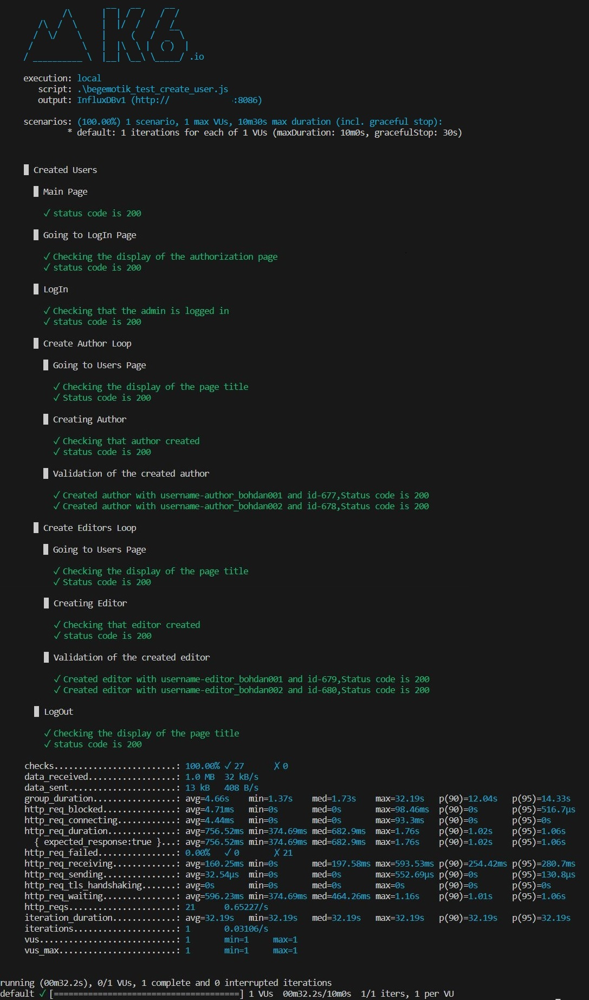

# Web Performance Testing Test Plan using K6

This repository contains a k6 test script for conducting web performance testing on a website. The test script is organized according to the following steps:
## Test Plan Steps

### 1. Creating Users by Admin

- Create users with different roles:
  - Authors
  - Editors

### 2. Creation of Posts and Reading by Authors(in development)

- Authors create and post articles:
  - 20% of Authors post 2 articles each
  - 60% of Authors post 1 article each
- Authors read posts:
  - 20% of Authors read posts

### 3. Creation of Posts and Reading by Editors(in development)

- Editors create and post articles:
  - 20% of Editors comment 3 comments on random articles
  - 50% of Editors comment 1 comment on random articles
- Editors read posts:
  - 30% of Editors read posts

### 4. Deleting Posts and Comments(in development)

- Implement the deletion of posts and associated comments.


### 5. Removal of Authors and Editors(in development)

- Admin removes authors and editors.


## Viewing Test Results

You can obtain the test results in different ways:

- **Grafana and InfluxDB**:
  To visualize results in Grafana, create an InfluxDB database and configure Grafana's URL and port.

  For example:

  ```
  k6 run script.js --out influxdb=http://127.0.0.1:8086/k6database
  ```
 <p align="center">
  
  </p>

<br>

- **Command Line Reports**:
You can view the reports directly on the command line by running:
- ```k6 run script.js```

 <p align="center">
  
  </p>


<br>

- **Visual(HTML) Reports in [k6-reporter](https://github.com/benc-uk/k6-reporter)**:
To generate such a report, you need to add a few lines of code according to the documentation k6-reporter.

<br>

  <p align="center">
  
  </p>

  <p align="center">
  
  </p>

<br>

## Remember to tailor the file paths and URLs to your specific setup.
